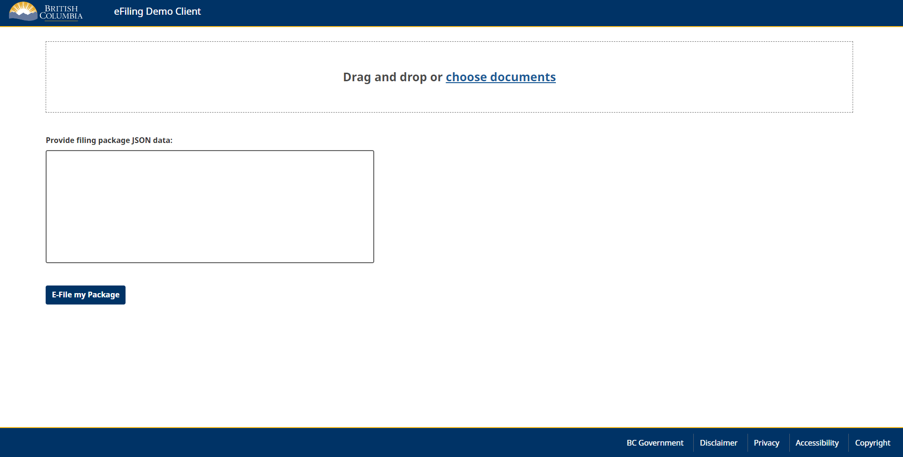

# EFiling Hub

[](https://github.com/bcgov/repomountie/blob/master/doc/lifecycle-badges.md) [](https://codeclimate.com/github/bcgov/jag-file-submission/maintainability) [](https://codeclimate.com/github/bcgov/jag-file-submission/test_coverage)  [](https://chat.developer.gov.bc.ca/group/efiling-hub-integration)

## Summary

As a component of the Court Digital Transformation Strategy (CDTS), the eFiling hub uses modern, secure, scalable, microservice architecture and API first design to facilitate easy integration of other applications (i.e. Family Law Act application, Online Divorce Assistant, Representation Agreement app) with the current electronic filing services that are provisioned by the Court Services Online application.

The eFiling hub is a foundational component to enhance citizen experiences for the submission of court documents electronically, while streamlining backend court registry processes.

## Project Structure

    .
    ├── .github                                 # Contains GitHub Related sources
    ├── openshift                               # openshift templates and pipeline
    ├── src/                                    # application source files
    │   ├── backend                             # backend applications
    │   │   ├── efiling-api                     # efiling api
    │   │   ├── libs                            # backend libraries
    │   │   |   ├── efiling-bambora-api-client  # bamabora swagger for client generation
    │   │   |   ├── efiling-bom                 # pom Bill Of Materials
    │   │   |   ├── efiling-commons             # efiling soap client that submits packages to CSO
    │   │   |   ├── efiling-cso-starter         # efiling soap client that contains all soap implementations
    │   │   |   └── efiling-demo-starter        # efiling demo app that mocks all soap implementations
    │   └── frontend                            # frontend applications
    │       ├── efiling-frontend                # efiling frontend
    │       └── efiling-demo                    # efiling demo app frontend
    ├── COMPLIANCE.yaml                         #
    ├── CONTRIBUTING.md                         #
    ├── LICENSE                                 # Apache License
    └── README.md                               # This file.

## Apps

| Name                | Description                                  | Doc                                                      |
| ------------------- | -------------------------------------------- | -------------------------------------------------------- |
| backend             | all server side services                     | [README](src/backend/README.md)                          |
| efiling-api         | the main api for interating with the service | [README](src/backend/efiling-api/README.md)              |
| efiling-cso-starter | soap client implementations                  | [README](src/backend/libs/efiling-cso-starter/README.md) |
| frontend            | all client side applications                 | [README](src/frontend/README.md)                         |
| efiling-frontend    | the frontend for uploading documents         | [README](src/frontend/efiling-frontend/README.md)        |
| efiling-demo        | the frontend for demo application            | [README](src/frontend/efiling-demo/README.md)            |
| cucumber-tests      | automated tests for frontend and backend     | [README](tests/README.md)                                |

## Running the App

By default a demo mode is enabled.

First create a local `.env` at the root of the repository based off [.env.template](.env.template). Below are the variables that need to be configured to get the application running in demo mode.

Configure Keycloak

run

```bash
docker-compose up -d
```

login at [http://localhost:3001](http://localhost:3001) with `bobross` and `changeme`

To get started, access the front end application [here](http://localhost:3001) use the following username `bobross` and password `changeme`



### List of services

#### efiling-frontend

React front end accessible at [http://localhost:3000](http://localhost:3000)

#### efiling-demo

React front end demo app accessible at [http://localhost:3001](http://localhost:3001)

#### efiling-api

Efiling Api check health at [http://localhost:8080/actuator/health](http://localhost:8080/actuator/health)

#### redis

A [redis](https://redis.io/) instance exposed on port 6379

#### redis commander

A [redis-commander](http://joeferner.github.io/redis-commander/) instance to query redis accessible at [http://localhost:8082](http://localhost:8082)

#### keycloak

A [keycloak](https://www.keycloak.org/) instance accessible at [http://localhost:8081/auth](http://localhost:8081/auth)

#### Spring starter update

When updating the spring starter ensure all hardcoded references are updated.
[Code Climate] (https://github.com/bcgov/jag-file-submission/blob/master/.github/workflows/code-climate-coverage-aggregation.yml)
[Docker File] (https://github.com/bcgov/jag-file-submission/blob/master/docker-compose.override.yml)
[Cucumber] (https://github.com/bcgov/jag-file-submission/blob/master/.github/workflows/cucumber-tests.yml)


## Github action

